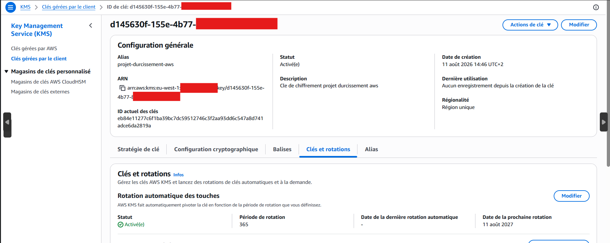
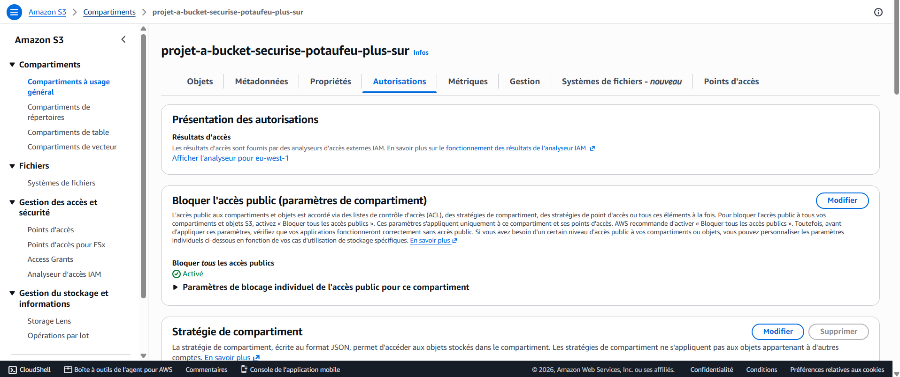
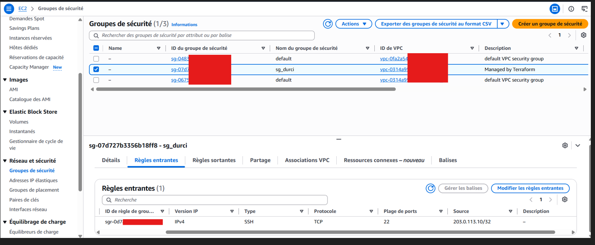
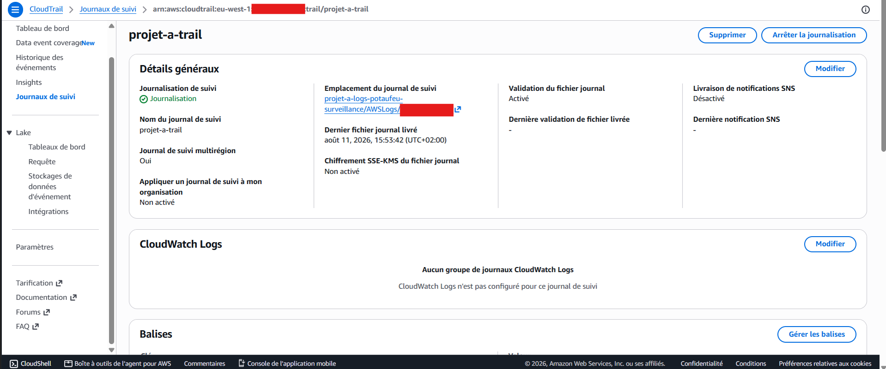
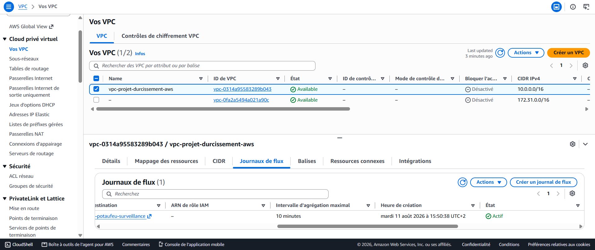

# durcissement-S3-AWS-AWS-S3-hardening-S3-AWS-H-rtung
AWS project to harden a S3 bucket

> 🌍 **Select your language / Choisissez votre langue**

[🇫🇷 Français](#français) ·
[🇬🇧 English](#english) ·
[🇩🇪 Deutsch](#deutsch) ·

---

## Français

## Objectif

Ce projet démontre la capacité à repérer des mauvaises configurations de sécurité courantes sur les buckets S3 et ce qui les entoures AWS, puis à les corriger de façon reproductible avec Terraform. La démarche suit une logique avant / après : on déploie d'abord une configuration non sécurisée, puis on la durcit contrôle par contrôle.


## Compétences acquises

- Maîtrise pratique de Terraform et de l'approche Infrastructure as Code.
- Compréhension approfondie du durcissement des services AWS (S3, IAM, KMS, VPC).
- Application du principe du moindre privilège dans la conception des rôles IAM.
- Mise en place de la traçabilité et de la surveillance (CloudTrail, VPC Flow Logs).
- Développement d'un réflexe « défenseur » : repérer une mauvaise configuration et la corriger.

## Outils utilisés
- Terraform (Infrastructure as Code)
- AWS : VPC, S3, IAM, KMS, CloudTrail, VPC Flow Logs
- Chiffrement : AWS KMS (clé gérée, avec rotation automatique)
## Étapes

Ref 1 : État « avant » | stockage S3 non protégé

Le bucket initial, sans blocage d'accès public ni chiffrement configuré. C'est la situation vulnérable de départ.
```hcl
code :
resource "aws_s3_bucket" "faible" {
  bucket = "projet-a-bucket-faible-potaufeu"
}
```


Ref 2 : État « avant » | pare-feu ouvert à tout internet

Le security group autorise l'ensemble du trafic entrant depuis 0.0.0.0/0, sur tous les ports. Configuration à corriger en priorité.

```hcl
resource "aws_security_group" "faible" {
  name        = "sg-trop-ouvert"
  description = "Volontairement non securise"

  ingress {
    from_port   = 0
    to_port     = 65535
    protocol    = "tcp"
    cidr_blocks = ["0.0.0.0/0"]
  }
}
```


Ref 3 : État « après » | blocage de l'accès public S3

Le même bucket, avec « Block public access » activé et le chiffrement au repos via une clé KMS gérée.

```hcl
resource "aws_s3_bucket" "securise" {
  bucket = "projet-a-bucket-securise-potaufeu-plus-sur"
}

# Dans un premier temps on bloque TOUT accès public
resource "aws_s3_bucket_public_access_block" "securise" {
  bucket                  = aws_s3_bucket.securise.id
  block_public_acls       = true
  block_public_policy      = true
  ignore_public_acls      = true
  restrict_public_buckets = true
}

# Ensuite on va chiffrer avec notre clé KMS
resource "aws_s3_bucket_server_side_encryption_configuration" "securise" {
  bucket = aws_s3_bucket.securise.id
  rule {
    apply_server_side_encryption_by_default {
      sse_algorithm     = "aws:kms"
      kms_master_key_id = aws_kms_key.principale.arn
    }
  }
}
```


Ref 4 : État « après » | pare-feu resserré

Le security group durci : on passe de « tout ouvert à tout internet » à une seule connexion SSH autorisée depuis une seule adresse IP, selon le principe du moindre accès.
```hcl
code:
#ici on crée le VPC puis on le segment en sous réseau.
resource "aws_vpc" "principal" {
  cidr_block = "10.0.0.0/16"
  tags       = { Name = "vpc-projet-a" }
}

resource "aws_subnet" "prive" {
  vpc_id     = aws_vpc.principal.id
  cidr_block = "10.0.1.0/24"
  tags       = { Name = "subnet-prive" }
}

# Puis on endurcie le groupe de sécurité\Pare-feu en laissant uniquement une connexion SSH depuis une certaine IP
resource "aws_security_group" "securise" {
  name   = "sg-durci"
  vpc_id = aws_vpc.principal.id

  ingress {
    from_port   = 22
    to_port     = 22
    protocol    = "tcp"
    cidr_blocks = ["203.0.113.10/32"]
  }

  egress {
    from_port   = 0
    to_port     = 0
    protocol    = "-1"
    cidr_blocks = ["0.0.0.0/0"]
  }
}
```



Ref 5 : Chiffrement | clé KMS avec rotation

Clé KMS gérée par le client, rotation automatique activée, utilisée pour chiffrer le stockage.
```hcl
code:
resource "aws_kms_key" "principale" {
  description             = "Cle de chiffrement projet A"
  deletion_window_in_days = 7
  enable_key_rotation     = true
}

resource "aws_kms_alias" "principale" {
  name          = "alias/projet-a"
  target_key_id = aws_kms_key.principale.key_id
}
```

Ref 6 : Traçabilité | CloudTrail actif

CloudTrail configuré en multi-région avec validation de l'intégrité des journaux : chaque action sur le compte est enregistrée.
```hcl
code:
data "aws_caller_identity" "moi" {}

# --- Bucket de logs ---
#Ici nous allons créer un nouveau bucket pour stocker les logs en créant une policy pour que CloudTrail puisse avoir accèss et utiliser ces logs via les deux actions "s3:GetBucketAcl" et "s3:PutObject". 
resource "aws_s3_bucket" "logs" {
  bucket = "projet-a-logs-CHANGE-MOI-12345"
}
resource "aws_s3_bucket_public_access_block" "logs" {
  bucket                  = aws_s3_bucket.logs.id
  block_public_acls       = true
  block_public_policy      = true
  ignore_public_acls      = true
  restrict_public_buckets = true
}
resource "aws_s3_bucket_policy" "logs" {
  bucket = aws_s3_bucket.logs.id
  policy = jsonencode({
    Version = "2012-10-17"
    Statement = [
      { Effect = "Allow", Principal = { Service = "cloudtrail.amazonaws.com" },
        Action = "s3:GetBucketAcl", Resource = aws_s3_bucket.logs.arn },
      { Effect = "Allow", Principal = { Service = "cloudtrail.amazonaws.com" },
        Action = "s3:PutObject",
        Resource = "${aws_s3_bucket.logs.arn}/AWSLogs/${data.aws_caller_identity.moi.account_id}/*" }
    ]
  })
}

# --- CloudTrail ---
#Maintenant nous configurons CloudTrail pour qu'il soit multi-régionnal et qu'Il y ait une validation des logs avant analyse.
resource "aws_cloudtrail" "principal" {
  name                       = "projet-a-trail"
  s3_bucket_name             = aws_s3_bucket.logs.id
  is_multi_region_trail      = true
  enable_log_file_validation = true
  depends_on                 = [aws_s3_bucket_policy.logs]
}
```


Ref 7 : Surveillance réseau | VPC Flow Logs

Les VPC Flow Logs capturent le trafic réseau du VPC, complétant la visibilité offerte par CloudTrail.
```hcl
# --- VPC Flow Logs ---
#Ici nous avons la suite du code précédent pour activer Le traqueur de fluxs de AWS a travers le vpc.
resource "aws_flow_log" "vpc" {
  vpc_id               = aws_vpc.principal.id
  traffic_type         = "ALL"
  log_destination      = aws_s3_bucket.logs.arn
  log_destination_type = "s3"
}
```


## Note

GuardDuty n'a pas été inclus dans cette version : son activation nécessite une éligibilité de compte qui n'était pas disponible au moment de la réalisation. La détection repose ici sur CloudTrail et les VPC Flow Logs. Le projet est un exercice de durcissement, et non une architecture de production (ni haute disponibilité, ni gestion multi-comptes).

[⬆️ Retour au menu](#nom-du-projet)

---

## English

## Objective
 
This project demonstrates the ability to spot common security misconfigurations on S3 buckets and their surrounding AWS resources, then to fix them reproducibly with Terraform. It follows a before / after approach: an insecure configuration is deployed first, then hardened control by control.
 
## Skills Learned
 
- Hands-on mastery of Terraform and the Infrastructure as Code approach.
- In-depth understanding of AWS service hardening (S3, IAM, KMS, VPC).
- Application of the least-privilege principle when designing IAM roles.
- Setting up auditability and monitoring (CloudTrail, VPC Flow Logs).
- Building a "defender" mindset: spotting a misconfiguration and fixing it.
## Tools Used
 
- Terraform (Infrastructure as Code)
- AWS: VPC, S3, IAM, KMS, CloudTrail, VPC Flow Logs
- Encryption: AWS KMS (managed key, with automatic rotation)
## Steps
 
Ref 1: "Before" state | unprotected S3 storage
 
The initial bucket, with no public access block and no encryption configured. This is the vulnerable starting point.
 
```hcl
resource "aws_s3_bucket" "faible" {
  bucket = "projet-a-bucket-faible-potaufeu"
}
```
 

 
Ref 2: "Before" state | firewall open to the whole internet
 
The security group allows all inbound traffic from 0.0.0.0/0, on every port. A configuration to fix as a priority.
 
```hcl
resource "aws_security_group" "faible" {
  name        = "sg-trop-ouvert"
  description = "Volontairement non securise"
 
  ingress {
    from_port   = 0
    to_port     = 65535
    protocol    = "tcp"
    cidr_blocks = ["0.0.0.0/0"]
  }
}
```
 

 
Ref 3: "After" state | blocking public access to S3
 
The same bucket, with "Block public access" enabled and encryption at rest via a managed KMS key.
 
```hcl
resource "aws_s3_bucket" "securise" {
  bucket = "projet-a-bucket-securise-potaufeu-plus-sur"
}
 
# First, block ALL public access
resource "aws_s3_bucket_public_access_block" "securise" {
  bucket                  = aws_s3_bucket.securise.id
  block_public_acls       = true
  block_public_policy      = true
  ignore_public_acls      = true
  restrict_public_buckets = true
}
 
# Then encrypt with our KMS key
resource "aws_s3_bucket_server_side_encryption_configuration" "securise" {
  bucket = aws_s3_bucket.securise.id
  rule {
    apply_server_side_encryption_by_default {
      sse_algorithm     = "aws:kms"
      kms_master_key_id = aws_kms_key.principale.arn
    }
  }
}
```
 


 
Ref 4: "After" state | tightened firewall
 
The hardened security group: moving from "wide open to the whole internet" to a single SSH connection allowed from a single IP address, following the least-access principle.
 
```hcl
# Here we create the VPC and segment it into a subnet.
resource "aws_vpc" "principal" {
  cidr_block = "10.0.0.0/16"
  tags       = { Name = "vpc-projet-a" }
}
 
resource "aws_subnet" "prive" {
  vpc_id     = aws_vpc.principal.id
  cidr_block = "10.0.1.0/24"
  tags       = { Name = "subnet-prive" }
}
 
# Then we harden the security group / firewall by allowing only an SSH connection from a specific IP
resource "aws_security_group" "securise" {
  name   = "sg-durci"
  vpc_id = aws_vpc.principal.id
 
  ingress {
    from_port   = 22
    to_port     = 22
    protocol    = "tcp"
    cidr_blocks = ["203.0.113.10/32"]
  }
 
  egress {
    from_port   = 0
    to_port     = 0
    protocol    = "-1"
    cidr_blocks = ["0.0.0.0/0"]
  }
}
```
 

 
Ref 5: Encryption | KMS key with rotation
 
Customer-managed KMS key, automatic rotation enabled, used to encrypt storage.
 
```hcl
resource "aws_kms_key" "principale" {
  description             = "Cle de chiffrement projet A"
  deletion_window_in_days = 7
  enable_key_rotation     = true
}
 
resource "aws_kms_alias" "principale" {
  name          = "alias/projet-a"
  target_key_id = aws_kms_key.principale.key_id
}
```
 

 
Ref 6: Auditability | CloudTrail enabled
 
CloudTrail configured as multi-region with log file integrity validation: every action on the account is recorded.
 
```hcl
data "aws_caller_identity" "moi" {}
 
# --- Logs bucket ---
# Here we create a new bucket to store the logs, adding a policy so that CloudTrail
# can access and use these logs through the two actions "s3:GetBucketAcl" and "s3:PutObject".
resource "aws_s3_bucket" "logs" {
  bucket = "projet-a-logs-CHANGE-MOI-12345"
}
 
resource "aws_s3_bucket_public_access_block" "logs" {
  bucket                  = aws_s3_bucket.logs.id
  block_public_acls       = true
  block_public_policy      = true
  ignore_public_acls      = true
  restrict_public_buckets = true
}
 
resource "aws_s3_bucket_policy" "logs" {
  bucket = aws_s3_bucket.logs.id
  policy = jsonencode({
    Version = "2012-10-17"
    Statement = [
      { Effect = "Allow", Principal = { Service = "cloudtrail.amazonaws.com" },
        Action = "s3:GetBucketAcl", Resource = aws_s3_bucket.logs.arn },
      { Effect = "Allow", Principal = { Service = "cloudtrail.amazonaws.com" },
        Action = "s3:PutObject",
        Resource = "${aws_s3_bucket.logs.arn}/AWSLogs/${data.aws_caller_identity.moi.account_id}/*" }
    ]
  })
}
 
# --- CloudTrail ---
# Now we configure CloudTrail so that it is multi-region and validates the logs
# before analysis.
resource "aws_cloudtrail" "principal" {
  name                       = "projet-a-trail"
  s3_bucket_name             = aws_s3_bucket.logs.id
  is_multi_region_trail      = true
  enable_log_file_validation = true
  depends_on                 = [aws_s3_bucket_policy.logs]
}
```
 

 
Ref 7: Network monitoring | VPC Flow Logs
 
VPC Flow Logs capture the VPC network traffic, complementing the visibility offered by CloudTrail.
 
```hcl
# --- VPC Flow Logs ---
# Here is the continuation of the previous code to enable AWS traffic tracking
# across the VPC.
resource "aws_flow_log" "vpc" {
  vpc_id               = aws_vpc.principal.id
  traffic_type         = "ALL"
  log_destination      = aws_s3_bucket.logs.arn
  log_destination_type = "s3"
}
```
 

 
## Note
 
GuardDuty was not included in this version: enabling it requires account eligibility that was not available at the time of this project. Detection here relies on CloudTrail and VPC Flow Logs. This project is a hardening exercise, not a production architecture (no high availability, no multi-account management).

Example below.
[⬆️ Back to menu](#nom-du-projet)

---

## Deutsch

## Ziel

Dieses Projekt zeigt, wie sich häufige Sicherheitskonfigurationsfehler bei S3-Buckets und im umgebenden AWS-Umfeld erkennen und anschließend mit Terraform reproduzierbar beheben lassen. Der Ansatz folgt einer Vorher-Nachher-Logik: Zunächst wird eine unsichere Konfiguration bereitgestellt, die dann Schritt für Schritt abgesichert wird.

## Erworbene Fähigkeiten

## Verwendete Werkzeuge
- Terraform (Infrastructure as Code)
- AWS: VPC, S3, IAM, KMS, CloudTrail, VPC Flow Logs
- Verschlüsselung: AWS KMS (verwalteter Schlüssel mit automatischer Rotation)

## Schritte


[⬆️ Zurück zum Menü](#nom-du-projet)
