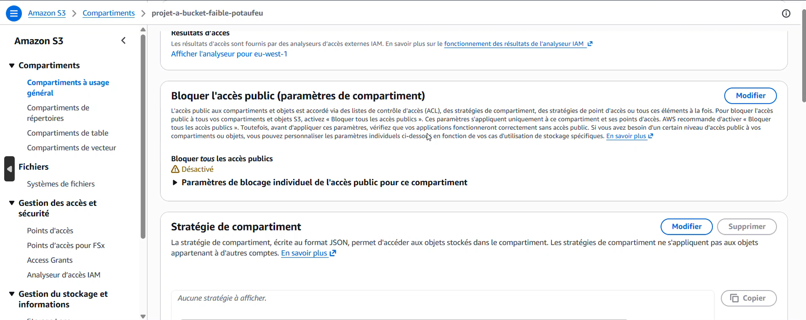
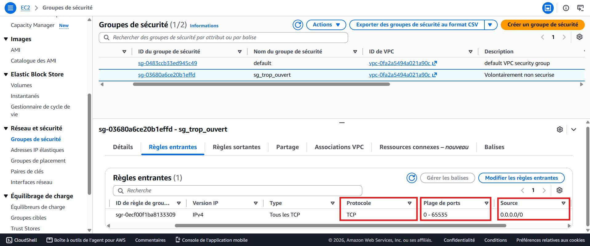

# durcissement-S3-AWS-AWS-S3-hardening-S3-AWS-H-rtung
AWS project to harden a S3 bucket

> 🌍 **Select your language / Choisissez votre langue**

[🇫🇷 Français](#français) ·
[🇬🇧 English](#english) ·
[🇩🇪 Deutsch](#deutsch) ·

---

## Français

## Objectif

Ce projet démontre la capacité à repérer des mauvaises configurations de sécurité courantes sur les buckets S3 et ce qui les entoures AWS, puis à les corriger de façon reproductible avec Terraform. La démarche suit une logique avant / après : on déploie d'abord une configuration non sécurisée, puis on la durcit contrôle par contrôle.


## Compétences acquises

## Outils utilisés
- Terraform (Infrastructure as Code)
- AWS : VPC, S3, IAM, KMS, CloudTrail, VPC Flow Logs
- Chiffrement : AWS KMS (clé gérée, avec rotation automatique)
## Étapes

Ref 1 : Diagramme d'architecture

Vue d'ensemble de l'infrastructure durcie : réseau, stockage chiffré, gestion des accès et surveillance.

Afficher l'image

Ref 2 : État « avant » — stockage S3 non protégé

Le bucket initial, sans blocage d'accès public ni chiffrement configuré. C'est la situation vulnérable de départ.
```hcl
code :
resource "aws_s3_bucket" "faible" {
  bucket = "projet-a-bucket-faible-potaufeu"
}
```


Ref 3 : État « avant » — pare-feu ouvert à tout internet

Le security group autorise l'ensemble du trafic entrant depuis 0.0.0.0/0, sur tous les ports. Configuration à corriger en priorité.

```hcl
resource "aws_security_group" "faible" {
  name        = "sg-trop-ouvert"
  description = "Volontairement non securise"

  ingress {
    from_port   = 0
    to_port     = 65535
    protocol    = "tcp"
    cidr_blocks = ["0.0.0.0/0"]
  }
}
```



Ref 4 : État « après » — blocage de l'accès public S3

Le même bucket, avec « Block public access » activé et le chiffrement au repos via une clé KMS gérée.

Afficher l'image

Ref 5 : État « après » — pare-feu resserré

Le security group durci : accès limité à un seul port et une seule adresse IP source, selon le principe du moindre accès.

Afficher l'image

Ref 6 : Chiffrement — clé KMS avec rotation

Clé KMS gérée par le client, rotation automatique activée, utilisée pour chiffrer le stockage.

Afficher l'image

Ref 7 : Traçabilité — CloudTrail actif

CloudTrail configuré en multi-région avec validation de l'intégrité des journaux : chaque action sur le compte est enregistrée.

Afficher l'image

Ref 8 : Surveillance réseau — VPC Flow Logs

Les VPC Flow Logs capturent le trafic réseau du VPC, complétant la visibilité offerte par CloudTrail.

Afficher l'image

Note

GuardDuty n'a pas été inclus dans cette version : son activation nécessite une éligibilité de compte qui n'était pas disponible au moment de la réalisation. La détection repose ici sur CloudTrail et les VPC Flow Logs. Le projet est un exercice de durcissement, et non une architecture de production (ni haute disponibilité, ni gestion multi-comptes).

[⬆️ Retour au menu](#nom-du-projet)

---

## English

## Objective

This project demonstrates the ability to identify common security misconfigurations in S3 bucket ans its surrounding AWS and then fix them in a reproducible manner using Terraform. The approach follows a “before and after” logic: first, an insecure configuration is deployed, and then it is hardened one control at a time.

## Skills Learned
[Bullet Points - Remove this afterwards]

Advanced understanding of SIEM concepts and practical application.
Proficiency in analyzing and interpreting network logs.
Ability to generate and recognize attack signatures and patterns.
Enhanced knowledge of network protocols and security vulnerabilities.
Development of critical thinking and problem-solving skills in cybersecurity.

## Tools Used

- Terraform (Infrastructure as Code)
- AWS: VPC, S3, IAM, KMS, CloudTrail, VPC Flow Logs
- Encryption: AWS KMS (managed key, with automatic rotation)

## Steps

drag & drop screenshots here or use imgur and reference them using imgsrc

Every screenshot should have some text explaining what the screenshot is about.

Example below.
[⬆️ Back to menu](#nom-du-projet)

---

## Deutsch

## Ziel

Dieses Projekt zeigt, wie sich häufige Sicherheitskonfigurationsfehler bei S3-Buckets und im umgebenden AWS-Umfeld erkennen und anschließend mit Terraform reproduzierbar beheben lassen. Der Ansatz folgt einer Vorher-Nachher-Logik: Zunächst wird eine unsichere Konfiguration bereitgestellt, die dann Schritt für Schritt abgesichert wird.

## Erworbene Fähigkeiten

## Verwendete Werkzeuge
- Terraform (Infrastructure as Code)
- AWS: VPC, S3, IAM, KMS, CloudTrail, VPC Flow Logs
- Verschlüsselung: AWS KMS (verwalteter Schlüssel mit automatischer Rotation)

## Schritte


[⬆️ Zurück zum Menü](#nom-du-projet)
